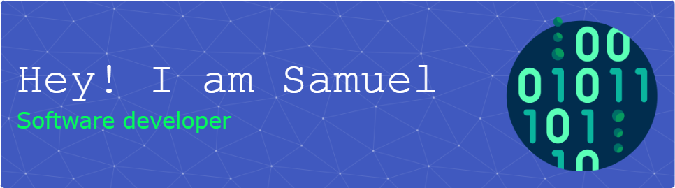

<div align="center">
  
</div>

<div align="center" style="font-size: 1.1em;">
  A dedicated Full Stack Developer based in Douala, Cameroon, with a wealth of experience in building diverse web, mobile, and desktop applications. I'm always eager to collaborate on innovative projects and bring creative ideas to life.
</div>

---


## 🌐 Connect with me

<div align="center">

[](https://www.linkedin.com/in/samuel-sikati-kenmogne-57953a1b7/)
[](mailto:sikatikenmogne@gmail.com)
[](https://wakatime.com/@sikatikenmogne)
[](https://roadmap.sh/u/samuelsikati)
[](https://leetcode.com/u/sikatikenmogne)
[](https://medium.com/@sikatikenmogne)
[](https://stackoverflow.com/users/24794943/samuel-sikati)


</div>

## 🛠️ My Tech Stack

<details open>
<summary style="font-size: 1.1em;"><strong>Click to hide/show 👀</strong></summary>

### 👨‍💻 Languages


### 🧰 Frameworks, Platforms & Libraries


[](https://pnpm.io/)


### 📊 ML/DL


### 🗄️ Databases / ORM


### ✍️ Technical Writing


### 🖥️ Servers


### ☁️ Hosting / SaaS


### 🔄 DevOps Tools


### 💻 Software & Development Tools


---

</details>

## 🛤️ My Learning Journey

<div align="center">

[](https://roadmap.sh/u/samuelsikati)

</div>

---

## 📈 Stats

### [](https://wakatime.com/@018cee13-789a-4312-ba87-bff7005ff31b)

### 📊 This Week I Spent My Time On

<!--START_SECTION:waka-->

```txt
Other      20 hrs 6 mins   ████████████████████████▒   96.96 %
TeX        19 mins         ▒░░░░░░░░░░░░░░░░░░░░░░░░   01.56 %
Markdown   16 mins         ▒░░░░░░░░░░░░░░░░░░░░░░░░   01.36 %
Text       1 min           ░░░░░░░░░░░░░░░░░░░░░░░░░   00.11 %
LaTeX      0 secs          ░░░░░░░░░░░░░░░░░░░░░░░░░   00.01 %
```

<!--END_SECTION:waka-->

---

### :octocat: GitHub Stats

<div align="center">

  
  
  

</div>

---

### 🏆 GitHub Trophies

<div align="center">

  

</div>
